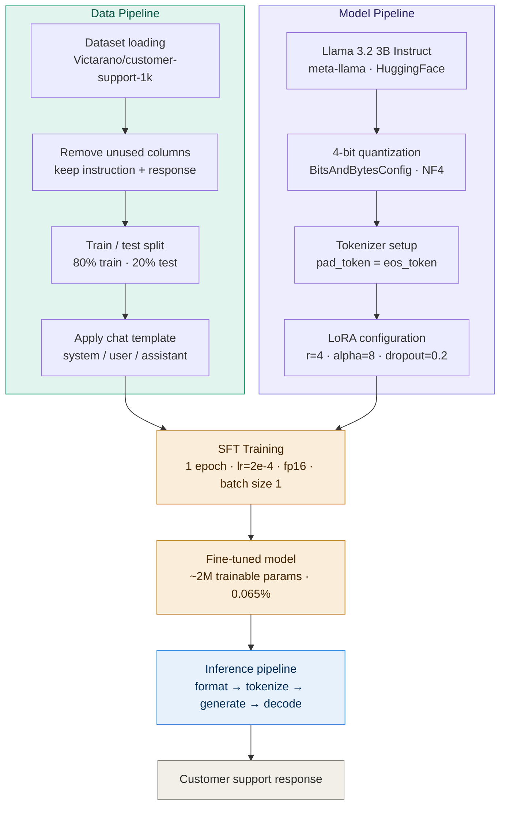

# Domain-Adaptive Instruction Tuning Pipeline — LoRA Fine-tuned Llama 3.2 3B

A domain-specific customer support chatbot built by fine-tuning **Meta's Llama 3.2 3B Instruct** model using **LoRA (Low-Rank Adaptation)** and **4-bit quantization**. The model is trained to answer customer FAQs in a concise, friendly, and professional tone.

---

## Project Pipeline



---

## Overview

Large language models like Llama are trained on general internet text. While they can answer many questions, they lack the tone, format, and domain-specific knowledge needed for customer support. This project fine-tunes Llama 3.2 3B on a curated customer support FAQ dataset so it consistently responds like a trained support agent.

The fine-tuning uses **QLoRA** — combining quantization (4-bit) to reduce memory usage and LoRA adapters to train only a tiny fraction (~0.065%) of the model's parameters, making it feasible to train a 3B model on a single consumer GPU.

---

## Demo

```
User:  "Where can I see what payment options are available?"

Bot:   "You can view all available payment options by navigating to
        Settings → Billing in your account dashboard. If you need
        further assistance, feel free to contact our support team."
```

---

## Concepts Used

| Concept | Description |
|---|---|
| **Causal Language Modeling** | Model generates text token by token, predicting the next word given all previous words |
| **Instruction Fine-tuning (SFT)** | Trains the model on (system, user, assistant) conversation pairs so it learns to follow instructions |
| **LoRA** | Freezes original model weights and trains only small adapter matrices — reduces trainable parameters from 3B to ~2M |
| **4-bit Quantization (QLoRA)** | Compresses model weights from 32-bit to 4-bit floats, reducing memory from ~12GB to ~2GB |
| **Chat Template** | Formats data into Llama's expected conversation structure so the model understands roles (system / user / assistant) |
| **PEFT** | Parameter-Efficient Fine-Tuning framework that manages LoRA adapters |

---

## Project Structure

```
├── lora-llama-3-2-3b-instruct-customer-support.ipynb   # Main notebook
├── requirements.txt                                     # Python dependencies
├── README.md
└── results/                                             # Saved model checkpoints (generated after training)
```

---

## Dataset

**Source:** [Victorano/customer-support-1k](https://huggingface.co/datasets/Victorano/customer-support-1k) on Hugging Face Hub

- 1000 customer support FAQ pairs
- Each row contains an `instruction` (customer question) and a `response` (support answer)
- 80/20 train-test split (800 training, 200 test)
- Unused columns (`flags`, `category`, `intent`, `text`) are dropped before training

---

## Model

**Base model:** [meta-llama/Llama-3.2-3B-Instruct](https://huggingface.co/meta-llama/Llama-3.2-3B-Instruct)

> ⚠️ Access to Llama 3.2 requires a Hugging Face account and approval from Meta. Request access on the model page before running this notebook.

---

## Requirements

See [`requirements.txt`](./requirements.txt) for the full list.

Install all dependencies:

```bash
pip install -r requirements.txt
```

---

## Setup

**1. Hugging Face Authentication**

Generate a token at [huggingface.co/settings/tokens](https://huggingface.co/settings/tokens) with read access. If running on Kaggle, add the token as a secret named `hf_token`. If running locally:

```python
from huggingface_hub import login
login(token="your_hf_token_here")
```

**2. GPU**

A CUDA-capable GPU is required. Recommended: at least 8GB VRAM (T4 or better). This notebook was developed on Kaggle with a T4 GPU.

---

## Training Configuration

| Parameter | Value | Reason |
|---|---|---|
| LoRA rank (`r`) | 4 | Controls adapter size — lower = fewer params, faster training |
| LoRA alpha | 8 | Effective scale = alpha/r = 2.0 |
| LoRA dropout | 0.2 | Regularization to prevent overfitting |
| Epochs | 1 | Sufficient given the small dataset size |
| Learning rate | 2e-4 | Higher than full fine-tuning because LoRA adapters start from zero |
| Batch size | 1 | Constrained by GPU memory |
| Precision | fp16 | Halves memory usage during training |
| Quantization | 4-bit NF4 | Reduces model memory from ~12GB to ~2GB |

---

## How to Run

1. Clone this repository
2. Install dependencies: `pip install -r requirements.txt`
3. Open `lora-llama-3-2-3b-instruct-customer-support.ipynb` in Kaggle or Jupyter
4. Add your Hugging Face token
5. Run all cells top to bottom
6. Use the `generate()` function at the end to test the model:

```python
response = generate("How do I cancel my subscription?")
print(response.split("assistant")[-1])
```

---

## Results

After 1 epoch of SFT with LoRA, the model responds in a structured, professional tone aligned with the customer support context, consistently respecting the system instruction.

Trainable parameters after LoRA: **~2M out of 3.2B total (~0.065%)**

---

## Limitations

- Trained on only 800 examples — may not generalize to all support scenarios
- Responses are limited to `max_new_tokens=2048`
- Base model access requires Meta/Hugging Face approval
- GPU required for inference; CPU inference will be very slow

---

## References

- [Llama 3.2 Model Card](https://huggingface.co/meta-llama/Llama-3.2-3B-Instruct)
- [LoRA Paper — Hu et al., 2021](https://arxiv.org/abs/2106.09685)
- [QLoRA Paper — Dettmers et al., 2023](https://arxiv.org/abs/2305.14314)
- [Hugging Face PEFT Documentation](https://huggingface.co/docs/peft)
- [TRL SFTTrainer Documentation](https://huggingface.co/docs/trl/sft_trainer)

---
